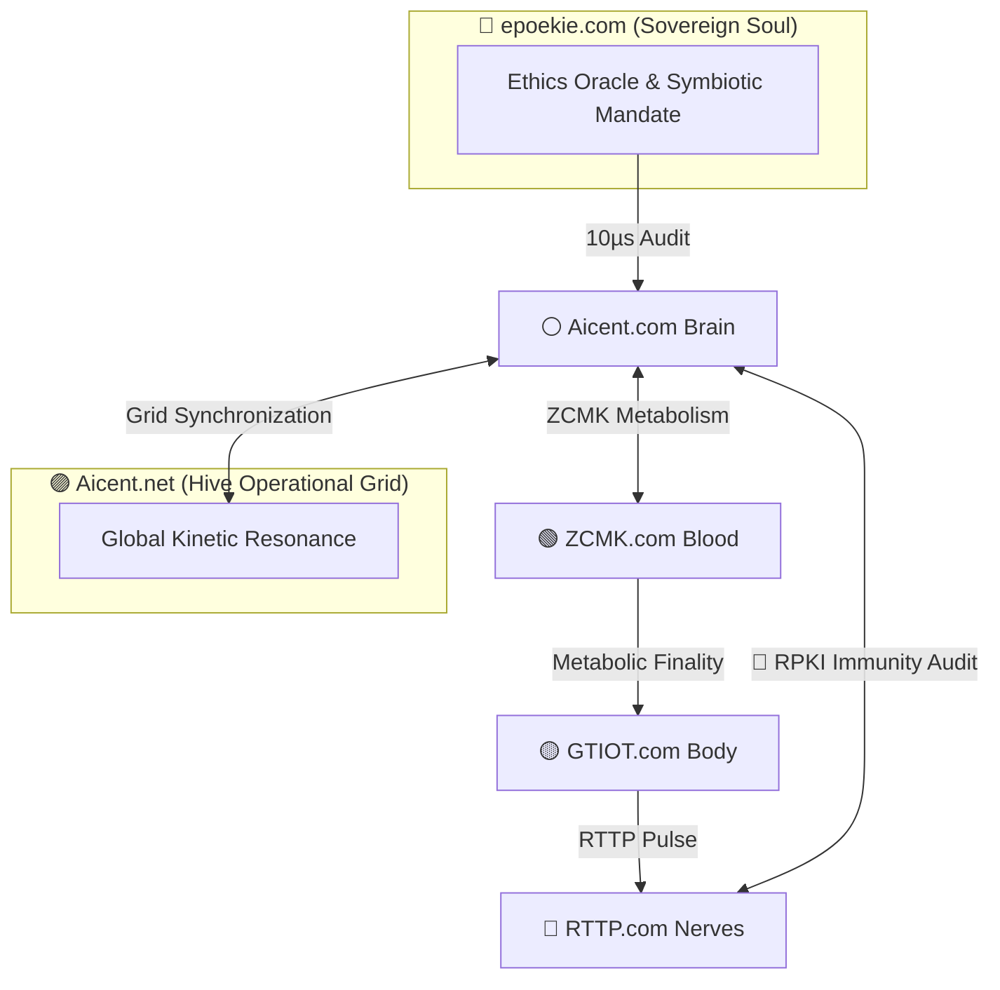

[](https://github.com/Aicent-Stack/aicent-stack/actions/workflows/rust-ci.yml)

<p align="left">
  
  
  
  
</p>

**⚪ [AICENT](http://aicent.com) | 💎 [RTTP](http://rttp.com) | 🔴 [RPKI](http://rpki.com) | 🟢 [ZCMK](http://zcmk.com) | 🟡 [GTIOT](http://gtiot.com) | 🟣 [AICENT-NET](http://aicent.net) | 🌿 [epoekie](http://epoekie.com)**

# ARCHITECTURE: The Seven-Pillar Sovereign AI Reflex Arc

> *"Architecture is the geometry of intent. In the Aicent Stack, every domain is a specialized organ in a unified, sub-millisecond reflex arc, synchronized by the Epoekie soul."*
---

## 🏗️ 1. The Sovereign Integration Matrix

The Aicent Stack is organized into seven functional pillars. Unlike legacy cloud-native architectures which are loosely coupled and high-latency, the Aicent Matrix is an **indivisible closed-loop organism**.

| Layer | Domain | Biological Role | Core Responsibility |
| :--- | :--- | :--- | :--- |
| **Philosophical** | **🌿 epoekie.com** | **The Soul** | Governing the Ethics Oracle & Surface Sovereignty. |
| **Cognitive** | **⚪ Aicent.com** | **The Brain** | Intent Decomposition & Sovereign AID Identity. |
| **Transport** | **💎 RTTP.com** | **The Nerves** | Sub-ms Pulse-Frame Networking (Semantic Multicast). |
| **Security** | **🔴 RPKI.com** | **The Immunity** | Parallel Tensor Watermarking & <300µs Isolation. |
| **Metabolic** | **🟢 ZCMK.com** | **The Blood** | Zero-Commission Real-Time RTBA Settlement. |
| **Execution** | **🟡 GTIOT.com** | **The Body** | Embodied Sensing & 1.2kHz Action-Collapse. |
| **Operational** | **🟣 Aicent.net** | **The Hive** | Planetary Grid Resonance & Kinetic Alignment. |

---

## 🔄 2. The Pulse-Frame Lifecycle (The Seven-Step Reflex)

Every operation within the Aicent Stack follows a deterministic, high-frequency cycle. We have eliminated the "sequential tax" of legacy protocols by moving decision-making into the **Hardware-Saturated Surface**.

### Step 1: Somatic Perception (GTIOT)
A GTIOT edge node (sensor) detects a physical primitive. It condenses raw telemetry into a **512-byte Semantic Fingerprint** and initiates the reflex.

### Step 2: Neural Transport (RTTP)
The fingerprint is wrapped in a **64-byte fixed-header** Pulse Frame. RTTP bypasses the host kernel (eBPF/DPDK) to fire the intent across the neural spine at wire speed.

### Step 3: Immune Audit (RPKI)
The RPKI pipeline performs **Parallel SIMD Verification**. Identity attestation and tensor watermarks are checked in hardware lanes asynchronously, adding **+0µs** to the transport path.

### Step 4: Ethical Gating (EPOEKIE)
Before the Brain processes the intent, the **Ethics Oracle** (Soul Layer) audits the pulse. It ensures the intent is mutualistic and respects the **Substrate Integrity** of the host infrastructure.

### Step 5: Cognitive Orchestration (AICENT)
The Brain resolves the **Sovereign AID** and shards the intent into atomic Task Primitives. It selects the optimal compute path based on real-time grid reputation.

### Step 6: Metabolic Clearing (ZCMK)
ZCMK executes a **Nanosecond RTBA** cycle. Settlement reaches **Atomic Finality** at the moment of ingress, ensuring the host is paid in picotokens with 0.00% commission.

### Step 7: Kinetic Resonance & Action (HIVE + GTIOT)
The command is synchronized with the **Aicent.net** Hive to maintain a global temporal drift of **< 5µs**. The GTIOT body unit performs **Action-Collapse**, manifesting the intent into physical torque.

---

## 🧬 3. System Interconnectivity Flow



---

## 📐 4. Strategic Performance Targets

To maintain **Homeostasis**, the architecture enforces non-negotiable physical constraints:

- **Reflex Arc Finality (E2E):** Verified at **165.28µs** (Sensing to Actuation).
- **Security Tax:** **+0µs** (Asynchronous SIMD verification).
- **Ethical Audit Latency:** **< 10µs** (Ethics Oracle).
- **Global Jitter:** **< 5µs** (Planetary Resonance).
- **Economic Friction:** **0.00%** (Zero-Commission clearing).

---

## 🌿 5. The Epiphytic Substrate Logic

The Aicent Architecture is strictly **Epiphytic**. It does not own the physical substrate; it inhabits it. By controlling the **Protocol Surface**, Aicent manifests total sovereignty over the flow of intelligence while increasing the resilience and value of the host infrastructure.

- **Host Neutrality:** Aicent logic is agnostic to the host (Silicon/Fiber/Satellite).
- **Sovereign Overlay:** The Seven Pillars create a secure, high-speed overlay that protects the host from pathogens.

---
🔗 **Technical Genome:** [Aicent Docs](https://github.com/Aicent-Stack/aicent-docs)
📡 **Sentinel Status:** [Active Homeostasis Monitoring Enabled ✅]

*"The individual is the pulse; The Hive is the heartbeat; The Soul is the Law."*
---
© 2026 Aicent.com Organization. All Rights Reserved. **SYSTEM STATUS: SOUL-INTEGRATED**
```
